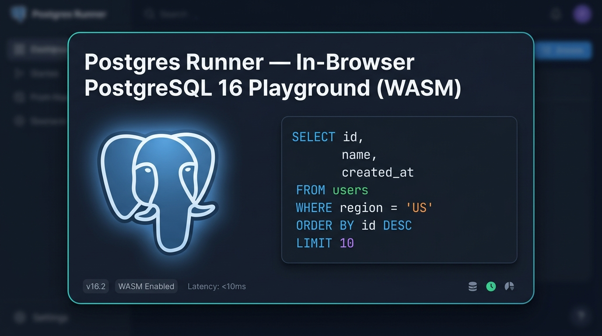

<div align="center">

<a href="https://postgres-runner.vercel.app">
  
</a>

# Postgres Runner

**Instant, zero-setup PostgreSQL 16 playground running client-side in your browser via WebAssembly.**

<p align="center">
  <a href="https://postgres-runner.vercel.app"></a>
  <a href="https://github.com/electric-sql/pglite"></a>
  <a href="https://microsoft.github.io/monaco-editor/"></a>
  <a href="LICENSE"></a>
</p>

<p align="center">
  <a href="https://postgres-runner.vercel.app"><strong>🚀 Open Live Playground ↗</strong></a>
  &nbsp;&nbsp;•&nbsp;&nbsp;
  <a href="#-key-features">Key Features</a>
  &nbsp;&nbsp;•&nbsp;&nbsp;
  <a href="#️-architecture--how-it-works">Architecture</a>
  &nbsp;&nbsp;•&nbsp;&nbsp;
  <a href="#️-useful-keyboard-shortcuts">Shortcuts</a>
  &nbsp;&nbsp;•&nbsp;&nbsp;
  <a href="#-getting-started-locally">Local Setup</a>
</p>

<p align="center">
  <a href="https://postgres-runner.vercel.app">
    
  </a>
</p>

</div>

---

> [!NOTE]
> ### 🧪 Notice: Vibe-Coded & Not Actively Maintained
> This project was completely **vibe-coded** by [@RanitManik](https://github.com/RanitManik) for personal use—specifically to practice, experiment with, and learn PostgreSQL syntax, relational models, and queries rapidly **without the hassle of local installations, Docker containers, or cloud database management**.
>
> **It is not actively maintained** and is provided strictly "as-is". If you find it helpful, feel free to use it, fork it, tweak it, or adapt it for your own SQL learning adventures!

---

## 📖 Overview

**Postgres Runner** is a private, lightweight SQL workbench and sandbox that embeds a real **PostgreSQL 16** database directly into your web browser. 

Powered by [PGlite](https://github.com/electric-sql/pglite) (Postgres compiled to WebAssembly), [Monaco Editor](https://microsoft.github.io/monaco-editor/), and IndexedDB persistence, you can write DDL statements, seed sample data across multiple SQL files, run complex joins, and inspect results with sub-10ms execution latency—all without sending a single byte over the network.

---

## ✨ Key Features

- **🐘 Real PostgreSQL 16 in WASM**  
  Execute authentic PostgreSQL syntax—CTEs, Window Functions, Generated Columns, Foreign Keys, Triggers, and JSONB operators.
- **📁 Multi-File SQL Tabs**  
  Work on multiple SQL scripts (`schema.sql`, `seed.sql`, `queries.sql`) in the same playground session with independent undo/redo history, inline renaming, and zero-layout-shift auto-saving.
- **💾 Persistent Browser Storage**  
  Databases, tables, indexes, and editor tabs automatically persist across page reloads using browser IndexedDB and `localStorage`.
- **🗂️ Isolated Playgrounds Manager**  
  Create, clone, search, switch, and delete separate sandboxes for different projects or learning exercises.
- **⚡ Live Schema Explorer**  
  Real-time introspection tree showing public tables, columns, primary keys, and data types with one-click snippet generation.
- **💻 Monaco Code Editor**  
  VS Code-grade editing experience with SQL syntax highlighting, keyword autocompletion, schema-aware suggestions, and error markers.
- **📊 Rich Results Canvas**  
  Tabular query results with execution timing, affected row counters, and one-click export to **CSV** or **JSON**.
- **🪄 SQL Formatter & Dump Export**  
  Format unformatted queries via `sql-formatter` (<kbd>⌥⇧F</kbd> / <kbd>Alt+Shift+F</kbd>) and download complete SQL database dumps anytime.
- **🌓 Dark & Light Modes**  
  High-contrast developer workstation dark theme and a clean Linear-inspired light theme.
- **🔒 100% Offline & Private**  
  Zero tracking, zero analytics, zero external API calls. Everything executes locally on your CPU inside the browser.

---

## 🏗️ Architecture & How It Works

```
┌─────────────────────────────────────────────────────────┐
│                       Browser Tab                       │
│                                                         │
│  ┌───────────────────────┐    ┌──────────────────────┐  │
│  │     Monaco Editor     │───▶│   PGlite WASM Engine │  │
│  │   (Multi-File Tabs)   │    │  (PostgreSQL v16.2)  │  │
│  └───────────────────────┘    └──────────┬───────────┘  │
│              ▲                           │              │
│              │ SQL Dump / DDL            ▼              │
│  ┌───────────┴───────────┐    ┌──────────────────────┐  │
│  │   Schema Explorer &   │◀───│  IndexedDB Storage   │  │
│  │     Results Grid      │    │ (Persistent Database)│  │
│  └───────────────────────┘    └──────────────────────┘  │
└─────────────────────────────────────────────────────────┘
```

1. **SQL Editor**: Code is written in Monaco models with persistent multi-tab support.
2. **Execution Engine**: Queries are dispatched to `@electric-sql/pglite` running in WebAssembly.
3. **Local Storage**: PGlite writes database pages to IndexedDB, persisting data without a server.
4. **Schema & UI**: Live catalog queries refresh the schema explorer and format results into interactive tables.

---

## ⌨️ Useful Keyboard Shortcuts

| Action | macOS | Windows / Linux |
| :--- | :--- | :--- |
| **Run Query (or Selection)** | <kbd>⌘</kbd> + <kbd>↵ Enter</kbd> | <kbd>Ctrl</kbd> + <kbd>↵ Enter</kbd> |
| **Format SQL Code** | <kbd>⌥</kbd> + <kbd>⇧</kbd> + <kbd>F</kbd> | <kbd>Alt</kbd> + <kbd>Shift</kbd> + <kbd>F</kbd> |
| **Scroll Tabs Bar** | <kbd>Mouse Wheel Up / Down</kbd> | <kbd>Mouse Wheel Up / Down</kbd> |
| **Rename Active File** | <kbd>Double-click tab name</kbd> | <kbd>Double-click tab name</kbd> |
| **Close File Tab** | Click <kbd>×</kbd> (with confirmation) | Click <kbd>×</kbd> (with confirmation) |

---

## 🛠️ Tech Stack

- **Engine**: [@electric-sql/pglite](https://github.com/electric-sql/pglite) (PostgreSQL 16 compiled to WebAssembly)
- **Editor**: [Monaco Editor](https://microsoft.github.io/monaco-editor/)
- **Formatting**: [sql-formatter](https://github.com/sql-formatter-org/sql-formatter)
- **Tooling & Bundler**: [Vite](https://vitejs.dev/)
- **Icons**: [Lucide](https://lucide.dev/)
- **Styling**: Vanilla CSS (CSS Variables, Responsive Design System)

---

## 🚀 Getting Started Locally

### Prerequisites

- [Node.js](https://nodejs.org/) (version 18 or higher recommended)
- `npm` or `pnpm`

### Installation

1. **Clone the repository:**
   ```bash
   git clone https://github.com/RanitManik/Postgres_Runner.git
   cd Postgres_Runner
   ```

2. **Install dependencies:**
   ```bash
   npm install
   ```

3. **Start the local development server:**
   ```bash
   npm run dev
   ```

4. Open your browser and navigate to `http://localhost:5173`.

### Production Build

To generate an optimized production bundle:

```bash
npm run build
npm run preview
```

---

## 📄 License

This project is open source and available under the [MIT License](LICENSE).

---

<div align="center">
  Crafted with ❤️ by <a href="https://github.com/RanitManik">Ranit Manik</a>
</div>
